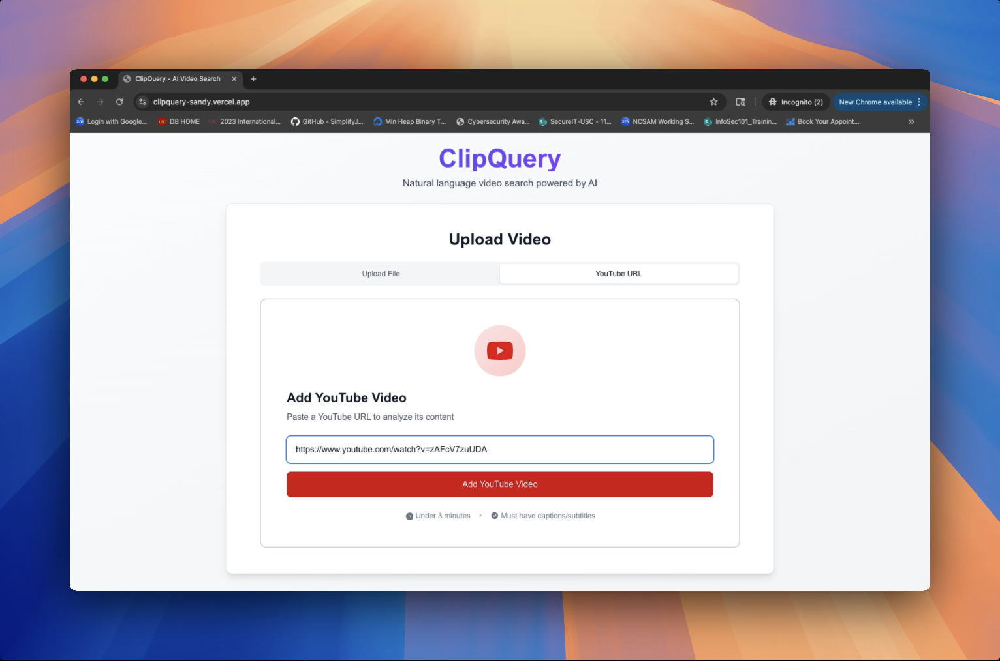

# ClipQuery

ClipQuery is a full-stack web application that enables users to search and navigate through video content using natural language queries. Built with modern web technologies, it transforms spoken words into searchable text with precise timestamp matching.

The application accepts video uploads up to 3 minutes in length, providing a natural language search interface where users can ask questions like "When does the presenter mention new product features?" and receive precise timestamp results. Additionally, it includes an interactive chatbot feature with real-time WebSocket messaging for engaging with video content.

## Live Demo

**[ Watch Demo Video →](https://youtu.be/_ZMthpKYgIM)** | **[ Try Live Platform →](https://clipquery-sandy.vercel.app/)**

*See ClipQuery in action with video upload, search, and chat capabilities*

## Platform Demo

### Uploaded Video Features

| **1. Video Upload Area** | **2. Video Player Interface** |
|:---:|:---:|
|  |  |
| *Drag & drop interface supporting MP4, MOV, AVI, MKV, and WebM formats up to 500MB* | *Interactive video player with timestamp controls and search result navigation* |

| **3. Transcript View** | **4. Search Results & Navigation** |
|:---:|:---:|
|  |  |
| *Full transcript display with segment timestamps and text content* | *Natural language search results with confidence scores and precise timestamps* |

| **5. Chat with Uploaded Video** |
|:---:|
|  |
| *Real-time WebSocket-powered chat interface for interactive video conversations* |

### YouTube Integration Features

| **6. YouTube URL Upload** | **7. YouTube Transcript Display** |
|:---:|:---:|
|  |  |
| *YouTube video processing with automatic transcript extraction* | *YouTube video transcript with timestamp synchronization* |

| **8. YouTube Video Search** | **9. Chat with YouTube Video** |
|:---:|:---:|
|  |  |
| *Semantic search across YouTube video content with result highlighting* | *Interactive chat interface for YouTube videos with context-aware responses* |

## Technical Architecture

### System Architecture

ClipQuery employs an architecture with clear separation between frontend presentation, backend business logic, and external service integrations. The system is designed for horizontal scalability and can handle cloud-scale operations.

**Frontend**: Next.js 15 with React 19, TypeScript, and Tailwind CSS 
**Backend**: FastAPI with Python 3.11, PostgreSQL, and vector embeddings 
**Infrastructure**: AWS ECS, CloudFront, S3, and Container Registry 
**AI Services**: OpenAI Whisper for transcription, OpenAI embeddings for semantic search 

#### Video Processing Pipeline

The video processing pipeline handles both uploaded files and YouTube URLs through a multi-stage approach:

1. **Video Ingestion**: Supports major formats (MP4, MOV, AVI, MKV, WebM) up to 500MB
2. **Audio Extraction**: Uses FFmpeg for high-quality audio extraction
3. **Transcription**: OpenAI Whisper provides industry-leading speech-to-text accuracy
4. **Segmentation**: Intelligent chunking preserves semantic meaning while optimizing for search
5. **Embedding Generation**: OpenAI's text-embedding-3-small model creates vector representations

## Architectural Decisions

**Video Upload**
- **Presigned S3 URLs**: Direct browser-to-S3 uploads bypass Vercel's 4.5MB serverless limit, supporting 500MB video files. Requires CORS configuration but eliminates server bandwidth constraints and enables scalable parallel uploads.
- **FFmpeg Audio Extraction**: Converts 75MB videos to 1.5MB MP3 audio since Whisper API has a 25MB file limit. 2-3 second processing overhead reduces API costs by 98% while ensuring all videos fit within constraints.

**Processing** 
- **OpenAI Whisper API**: Cloud transcription service chosen over self-hosting to avoid GPU infrastructure, model management, and scaling complexities. Higher per-request costs but provides superior accuracy with automatic language detection and multilingual support.

**Search & Storage**
- **Vector-First Search with Relational Persistence**: Pinecone handles semantic search and returns timestamps from metadata, while PostgreSQL manages video lifecycle, provides complete transcript access, and serves as fallback when vector search is unavailable.

**User Experience**
- **WebSocket Chat Streaming**: Real-time bidirectional communication delivers AI responses chunk-by-chunk as they generate. Connection management overhead justified by 60-70% improvement in perceived performance compared to waiting for complete responses.
- **YouTube Proxy Integration**: Proxy infrastructure handles cloud provider IP blocks for YouTube transcript access. Adds deployment complexity but enables seamless integration with YouTube's vast content library.

**Infrastructure**
- **ECS Fargate Containers**: Serverless container orchestration eliminates infrastructure management compared to self-managed Kubernetes. AWS vendor lock-in accepted for operational simplicity, auto-scaling, and zero-downtime deployments.
- **Retry with Exponential Backoff**: Automatic retry for transient failures with 3 attempts and exponential delays (1s→2s→4s). Prevents cascade failures during service disruptions while avoiding aggressive retry storms.

## User Flow

### User Interaction Flow

## Deployment Architecture

### Cloud Infrastructure 
- **AWS ECS Fargate**: Serverless container orchestration
- **Application Load Balancer**: Traffic distribution and SSL termination
- **CloudFront**: Global CDN with edge caching
- **S3**: Object storage for video files and static assets
- **Supabase**: Managed PostgreSQL with automatic backups
- **ECR**: Private container registry
